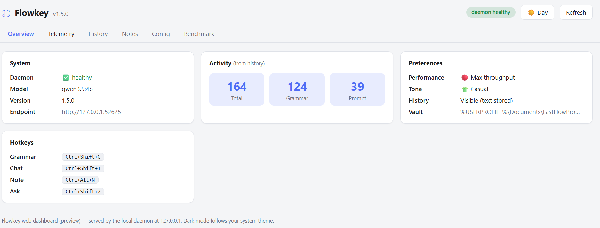
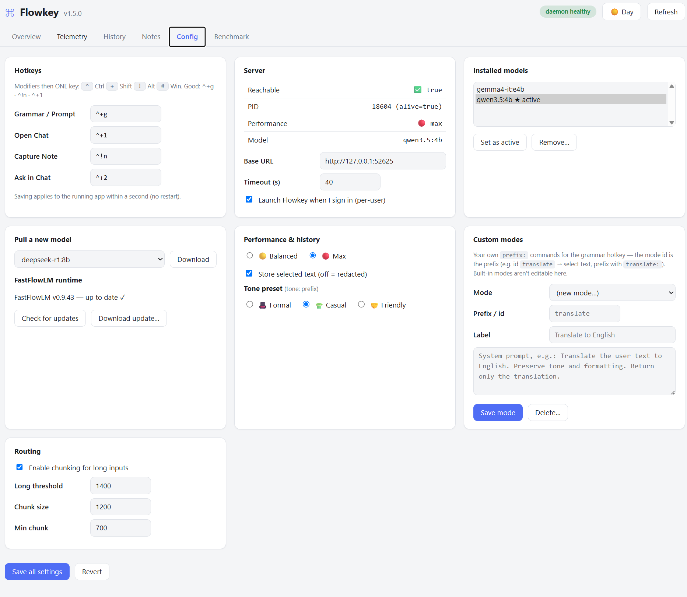

# Flowkey

Flowkey is a Windows desktop assistant that adds local-LLM hotkeys for grammar fixes, prompt rewrites, summaries, explanations, tone changes, chat, ask-in-chat, note capture, and FastFlowLM benchmarks.

Everything runs locally through [FastFlowLM](https://fastflowlm.com) (AMD Ryzen AI NPU) or, on machines without the NPU, through [Ollama](https://ollama.com) (CPU/GPU) as a secondary provider. No cloud service, analytics, or telemetry is used by the app.

Current version: `1.6.0`

## Screenshots

The dashboard is a web page served by the local daemon — these are the Overview and Config tabs (day theme):





## Requirements

- Windows 10/11 x64
- One local LLM backend:
  - **FastFlowLM** (`flm`) with a model such as `qwen3.5:4b` — needs an AMD Ryzen AI NPU, **or**
  - **Ollama** (`ollama`) with a model such as `llama3.2:3b` — any CPU/GPU
- Python 3.11+ for source/developer installs
- AutoHotkey v2+ for source installs

Pick the provider in Dashboard → Config → "LLM provider & server" (or let the first-run wizard detect what's installed). If the configured provider isn't available at runtime, Flowkey falls back to the other one automatically.

## AMD NPU And FastFlowLM Setup

Install these first on a new machine:

1. Install the latest AMD Ryzen AI / NPU driver from [AMD Support](https://www.amd.com/en/support) or from your laptop manufacturer's support page.
2. Reboot Windows after the driver install.
3. Confirm the NPU appears in **Device Manager** under **Neural processors** or as an AMD Ryzen AI / NPU device.
4. Install FastFlowLM from [fastflowlm.com](https://fastflowlm.com/) or directly with PowerShell:

```powershell
Invoke-WebRequest https://github.com/FastFlowLM/FastFlowLM/releases/latest/download/flm-setup.exe -OutFile flm-setup.exe
Start-Process .\flm-setup.exe -Wait
```

5. Open a new terminal and verify FastFlowLM:

```powershell
flm --version
flm pull qwen3.5:4b
flm run qwen3.5:4b
```

## Ollama Setup (no NPU required)

On machines without an AMD Ryzen AI NPU, install [Ollama](https://ollama.com/download/windows) instead:

```powershell
winget install Ollama.Ollama
ollama pull llama3.2:3b
```

Then pick **Ollama** in Dashboard → Config → "LLM provider & server" and click "Start server" (or run `ollama serve` yourself). Suggested starter models: `llama3.2:3b`, `qwen2.5:3b`, `gemma3:4b`.

## Install Flowkey

For source installs from this repository:

```powershell
.\INSTALL.cmd
```

For Python/developer installs:

```powershell
python -m pip install -e ".[dev]"
```

Launch the app with AutoHotkey v2:

```powershell
& "C:\Program Files\AutoHotkey\v2\AutoHotkey64.exe" .\scripts\grammarFix.ahk
```

## Hotkeys

| Hotkey | Action |
|---|---|
| `Ctrl+Shift+G` | Grammar fix on selected text |
| `prompt:` + `Ctrl+Shift+G` | Rewrite rough text into a structured prompt |
| `summarize:` + `Ctrl+Shift+G` | Create a 3-bullet summary |
| `explain:` + `Ctrl+Shift+G` | Explain code, regex, SQL, or technical text |
| `tone:` + `Ctrl+Shift+G` | Rewrite in the selected tone preset |
| `<custom>:` + `Ctrl+Shift+G` | Any mode you define in Dashboard → Config → Custom modes (e.g. `translate:`) |
| `Ctrl+Shift+T` | Open chat (each tab has a "My notes" toggle that grounds replies in your notes vault) |
| `Ctrl+Shift+A` | Ask in chat with selected text |
| `Ctrl+Alt+N` | Capture a note |

Prefix tip: put the keyword on the first line of your selection — `prompt: rough idea here` (or `prompt` on its own line, then the text). Without a prefix, `Ctrl+Shift+G` always runs a grammar fix.

## Dashboard

The dashboard is a web page served by the local daemon — open it from the tray menu ("Dashboard") or browse to `http://127.0.0.1:52650/`. It is loopback-only and works in any browser.

- **Tabs:** Overview, History, Telemetry, Notes, Benchmark, Config.
- **Theme:** auto-follows your OS day/night setting; the topbar button cycles auto → light → dark.
- **Custom modes:** Config → Custom modes lets you add your own `prefix:` commands (id + system prompt). Changes apply to the running app within a second.
- **Models:** pull models with live progress — pick a suggestion or type any name (on Ollama, anything from the [library](https://ollama.com/library) works); set active, remove. Suggestions are hardware-aware: detected RAM/VRAM caps the model size (e.g. 32 GB RAM → ~4B on the NPU; 8 GB VRAM → ~9B on the GPU), oversized models are hidden, and free-typing one asks before pulling.
- **Benchmark:** works on both providers — `flm bench` on FastFlowLM (~10–20 min, NPU), timed generations with native metrics on Ollama (~1–3 min, server keeps running).
- **Notes:** browse or search your vault; History shows recent runs (text is stored only if history storage is enabled).

## Project Layout

- `scripts/` - Python modules and AutoHotkey v2 app code.
- `installer/` - optional installer build scripts.
- `setup/defaults/` - default config used on first run.
- `tests/` - Python and AutoHotkey regression tests.
- `config/grammar_hotkey.config.example.json` - example user config.
- `assets/screenshots/` - README screenshots.

Runtime data, logs, build output, downloaded vendor binaries, caches, and local editor state are intentionally ignored and should not be committed.

## Development Checks

```powershell
python -m pip install -e ".[dev]"
ruff check scripts tests
pytest tests -q
```

AutoHotkey tests are run by CI on Windows. Locally, run them with AutoHotkey v2:

```powershell
& "C:\Program Files\AutoHotkey\v2\AutoHotkey64.exe" /ErrorStdOut tests\test_parse_mode.ahk
& "C:\Program Files\AutoHotkey\v2\AutoHotkey64.exe" /ErrorStdOut tests\test_classify_clipboard.ahk
```
